# Networking Fundamentals — Communications & Computing Lab

A small collection of Python exercises exploring core computer-networking
concepts: round-trip time measurement, TCP congestion control, and IPv4
subnetting. Each task is a self-contained script that uses only the Python
standard library (no third-party dependencies).

## Requirements

- Python 3.8+
- No external packages — everything uses the standard library (`socket`,
  `time`, `random`).

## Project structure

| File | Description |
| ---- | ----------- |
| `echo_server.py` | Minimal TCP echo server on `127.0.0.1:5000`, used to test Task 1. |
| `task1_rtt_client.py` | Measures round-trip time (RTT) over TCP or UDP and reports the average. |
| `task2_tcp_window.py` | Simulates TCP AIMD congestion-window growth with random packet loss. |
| `task3_ip_calc.py` | IPv4 / CIDR calculator: network, broadcast, host range, and host count. |

## How to run

### Task 1 — RTT probe (TCP/UDP)

Open two terminals. Start the echo server first:

```bash
python echo_server.py
```

Then, in a second terminal, run the RTT client:

```bash
python task1_rtt_client.py
```

By default it sends 10 TCP messages to `127.0.0.1:5000` and prints each RTT
plus the average. The protocol, message count, and timeout can be changed in
the `run_rtt_probe(...)` call at the bottom of the file (e.g. `protocol="udp"`).

### Task 2 — TCP AIMD congestion simulation

```bash
python task2_tcp_window.py
```

Simulates 50 RTT rounds with a 20% loss probability (fixed seed for
reproducibility) and prints the congestion window (`cwnd`) after each round.
On loss the window is halved (multiplicative decrease); otherwise it grows by
one MSS (additive increase).

### Task 3 — IPv4 / CIDR calculator

```bash
python task3_ip_calc.py
```

Prompts for a CIDR block and prints the subnet details. Example:

```
Enter CIDR notation (e.g., 192.168.1.0/24): 192.168.1.0/24
network: 192.168.1.0
broadcast: 192.168.1.255
first_host: 192.168.1.1
last_host: 192.168.1.254
hosts_count: 254
```

## Tests

Unit tests for the pure-logic tasks (Task 2 and Task 3) live in
`test_assignment.py`. They run with or without `pytest`:

```bash
python -m pytest test_assignment.py    # if pytest is installed
python test_assignment.py              # built-in fallback runner
```

## Wireshark analysis

The packet captures that document each experiment are under [`docs/`](docs/).

### Task 1 — RTT over the loopback echo

| | |
| --- | --- |
| Echo server running | 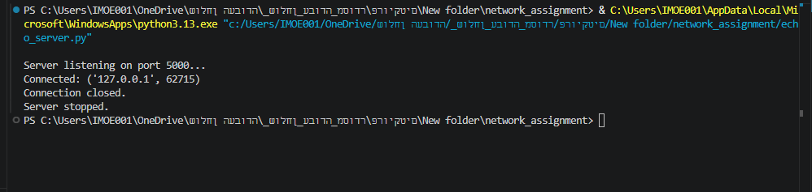 |
| RTT client output | 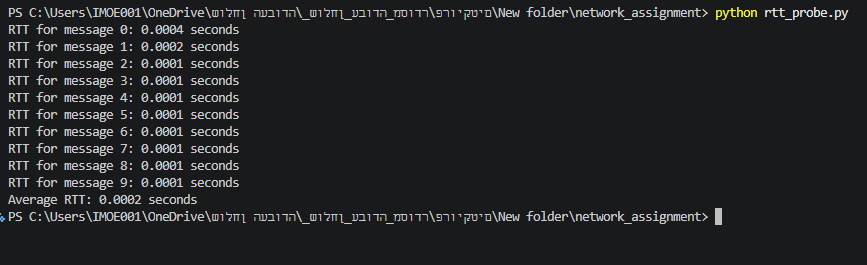 |
| TCP handshake + `"Message 0"` payload (`tcp.port == 5000`) | 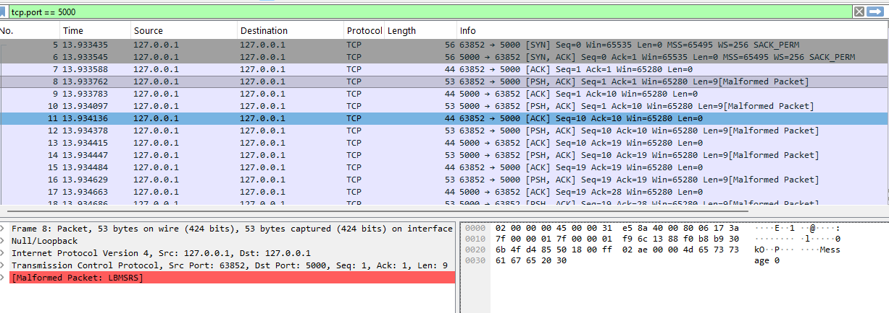 |
| Per-packet **Delta time** column (verifies the measured RTT) | 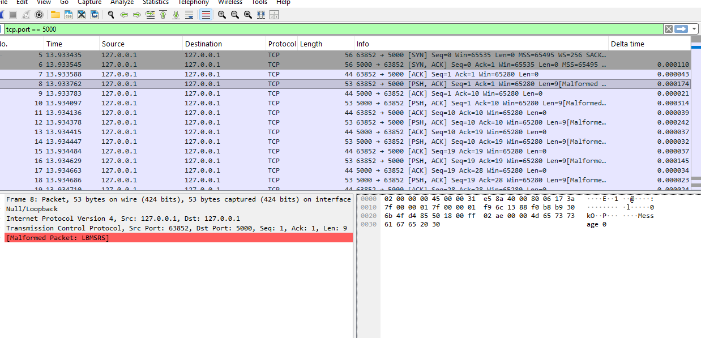 |

### Task 2 — AIMD vs. real TCP window

| | |
| --- | --- |
| Hand analysis of the AIMD sawtooth | 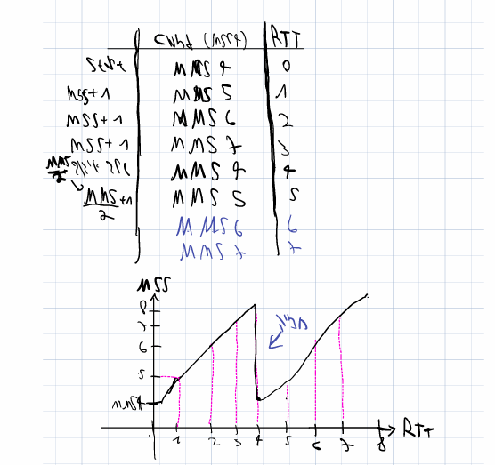 |
| `Statistics → TCP Stream Graphs → Window Scaling` (loopback) | 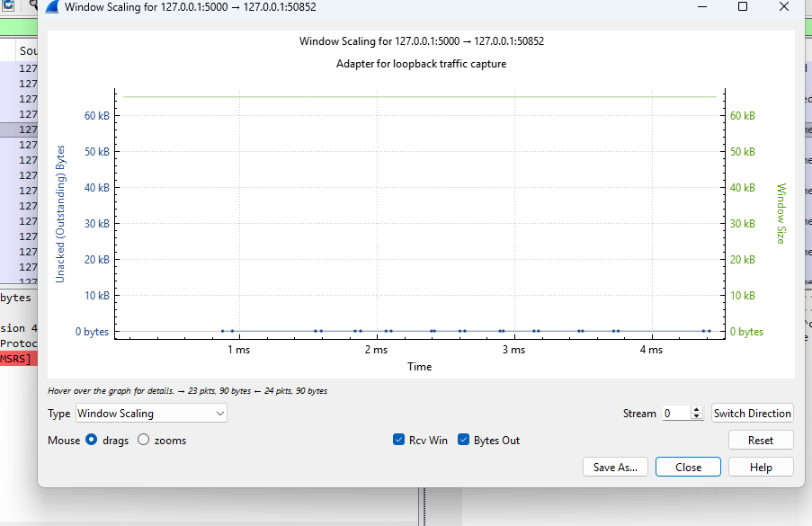 |
| Window scaling of a real TCP connection | 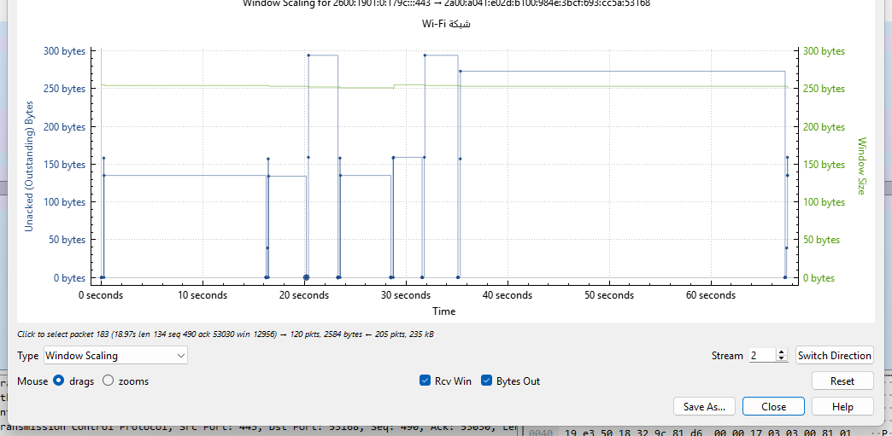 |

### Task 3 — IPv4 / CIDR against a real interface

| | |
| --- | --- |
| Calculator output for `192.168.1.89/24` | 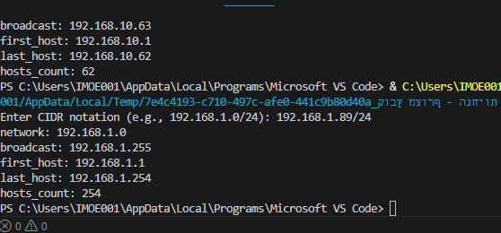 |
| Captured packets from the local address | 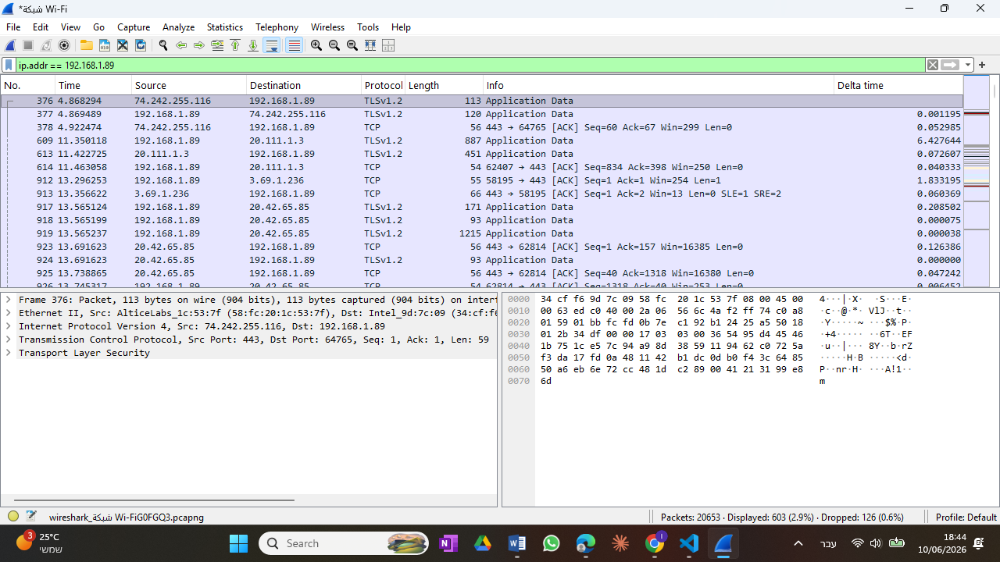 |
| Real interface address & subnet | 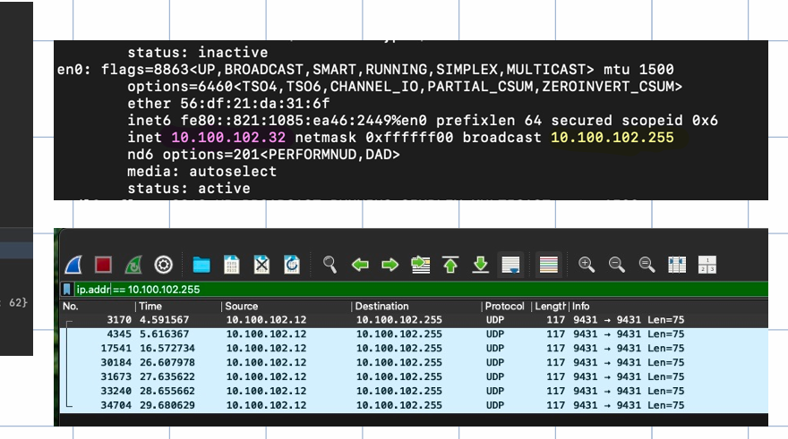 |
| Checking the address falls inside the host range | 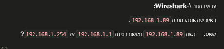 |

## Author

Abraheem — Communications & Computing course assignment.
