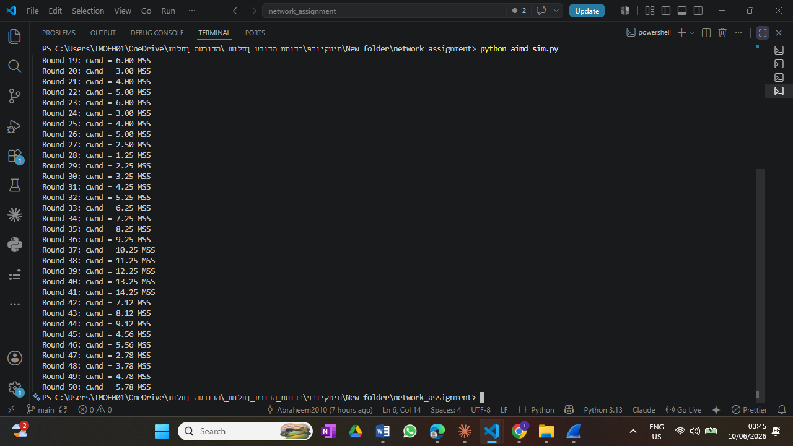
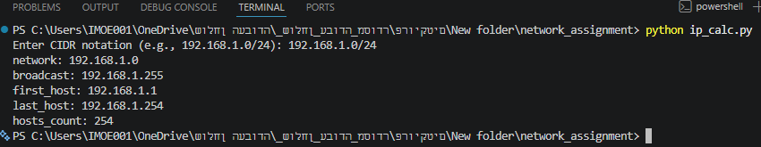
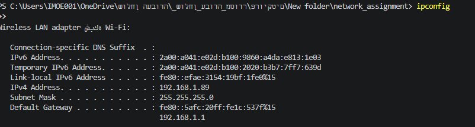

# Networking Fundamentals

[](https://github.com/Abraheem2010/networking-fundamentals-lab/actions/workflows/tests.yml)

A hands-on networking toolkit in pure Python: round-trip-time measurement
(TCP/UDP), a TCP AIMD congestion-control simulator, and an IPv4/CIDR subnet
calculator — each verified at the packet level with Wireshark. No third-party
dependencies; everything runs on the standard library.

## What this demonstrates

- **Socket programming** — TCP and UDP clients and a small echo server (`socket`)
- **TCP congestion control** — an AIMD (additive-increase / multiplicative-decrease) simulator
- **IPv4 addressing & subnetting** — CIDR parsing, masks, and network / broadcast / host-range math, including the `/31` and `/32` edge cases and input validation
- **Packet capture & analysis** — Wireshark verification of every experiment
- **Testing & CI** — 15 unit tests that run automatically on every push via GitHub Actions

## Requirements

- Python 3.8+
- Standard library only (`socket`, `time`, `random`, `argparse`)

## Components

| File | What it does |
| ---- | ----------- |
| `echo_server.py` | Minimal localhost-only TCP echo server (used to exercise the RTT client). |
| `rtt_probe.py` | Measures round-trip time over TCP or UDP; configurable from the command line. |
| `aimd_sim.py` | Simulates TCP AIMD congestion-window growth with random packet loss. |
| `ip_calc.py` | IPv4 / CIDR calculator: network, broadcast, host range, and host count. |

## How to run

### RTT probe over TCP/UDP — `rtt_probe.py`

Open two terminals. Start the echo server first:

```bash
python echo_server.py
```

Then, in a second terminal, run the RTT client:

```bash
python rtt_probe.py
```

By default it sends 10 TCP messages to `127.0.0.1:5000` and prints each RTT
plus the average. The protocol, host, port, message count, and timeout are all
configurable from the command line:

```bash
python rtt_probe.py --protocol udp --count 20 --timeout 1.5
```

### TCP AIMD congestion simulator — `aimd_sim.py`

```bash
python aimd_sim.py
```

Simulates 50 RTT rounds with a 20% loss probability (fixed seed for
reproducibility), prints the congestion window (`cwnd`) after each round, and
returns the `cwnd` history as a list. On loss the window is halved
(multiplicative decrease); otherwise it grows by one MSS (additive increase).

### IPv4 / CIDR calculator — `ip_calc.py`

```bash
python ip_calc.py
```

Prompts for a CIDR block and prints the subnet details. Example:

```
Enter CIDR notation (e.g., 192.168.1.0/24): 192.168.1.0/24
network: 192.168.1.0
broadcast: 192.168.1.255
first_host: 192.168.1.1
last_host: 192.168.1.254
hosts_count: 254
```

It also handles the special cases `/31` (2 usable hosts, RFC 3021) and `/32`
(a single host), and rejects malformed input such as octets above 255.

## Tests

```bash
python -m pytest test_networking.py    # if pytest is installed
python test_networking.py              # built-in fallback runner, no dependencies
```

The same suite runs in CI on Python 3.9, 3.11, and 3.12 (see the badge above).

## Packet-level verification (Wireshark)

Each experiment is backed by real packet captures and program output under [`docs/`](docs/).

### RTT over the loopback echo

| | |
| --- | --- |
| Echo server running |  |
| RTT client output (per-message RTT + average) |  |
| TCP handshake + `"Message 0"` payload (`tcp.port == 5000`) |  |
| Per-packet **Delta time** column (verifies the measured RTT) |  |

### AIMD vs. a real TCP window

| | |
| --- | --- |
| Simulation output (`cwnd` per round) |  |
| `Statistics → TCP Stream Graphs → Window Scaling` (loopback) |  |
| Window scaling of a real TCP connection |  |

### IPv4 / CIDR against a real interface

| | |
| --- | --- |
| Calculator output for `192.168.1.0/24` |  |
| Captured packets from the local address `192.168.1.89` |  |
| Real interface address & subnet (`ipconfig`) |  |

## License

Released under the [MIT License](LICENSE).

Built by **Abraheem**.
